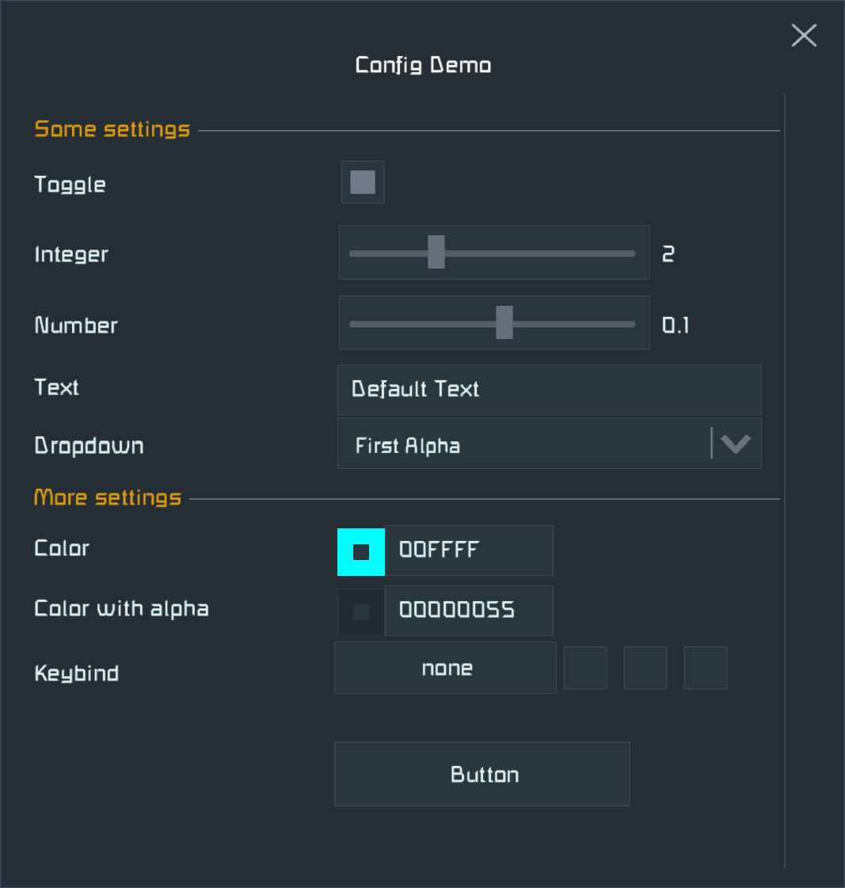

# Space Engineers Client Plugin Template

[Server/Client version of the template](https://github.com/sepluginloader/PluginTemplate)

## Prerequisites

- [Space Engineers](https://store.steampowered.com/app/244850/Space_Engineers/)
- [Python 3.12](https://python.org) (requires 3.12 or newer)
- [Pulsar](https://github.com/SpaceGT/Pulsar)
- [.NET Framework 4.8.1 Developer Pack](https://dotnet.microsoft.com/en-us/download/dotnet-framework/net481)

## Create your plugin project

1. Click on **Use this template** (top right corner on GitHub) and follow the wizard to create your repository
2. Clone your repository to have a local working copy
3. Run `setup.py`, enter the name of your plugin project in `CapitalizedWords` format
4. Let `setup.py` auto-detect your install location or fill it in manually
5. Open the solution in Visual Studio or Rider
6. Make a test build, the plugin's DLL should be deployed (see the build log for the path)
7. Test that the empty plugin can be enabled in Pulsar
8. Replace the contents of this file with the description of your plugin
9. Follow the TODO comments in the source code and implement your plugin

In case of questions please feel free to ask the SE plugin developer community on the
[Pulsar](https://discord.gg/z8ZczP2YZY) Discord server in their relevant text channels. 
They also have dedicated channels for plugin ideas, should you look for a new one.

_Good luck!_

## Remarks

### Plugin configuration

You can have a nice configuration dialog with little effort in the game client.
Customize the `Config` class in the `ClientPlugin` project, just follow the examples.
It supports many different data types, including key binding. Once you have more
options than can fit on the screen the dialog will have a vertical scrollbar.

### Debugging

- Always use a debug build if you want to set breakpoints and see variable values.
- A debug build defines `DEBUG`, so you can add conditional code in `#if DEBUG` blocks.
- While debugging a specific target unload the other two. It prevents the IDE to be confused.
- If breakpoints do not "stick" or do not work, then make sure that:
  - Other projects are unloaded, only the debugged one and Shared are loaded.
  - Debugger is attached to the running process.
  - You are debugging the code which is running (no code changes made since the build).

### Building and debugging on .NET 10

- Start the game with the `Interim.exe` Pulsar executable with the `-sources` command line option.
- Click on the Sources button in Pulsar's dialog, then set up a development folder for your plugin.
- Make sure to fill in the PluginHub registration XML (`YourPluginName.xml` in this repo) and load that as well.
- Select `Debug` mode and run `Interim.exe`, then attach the debugger. That should allow debugging your plugin.
- Select `Release` mode to test exactly how Pulsar will build and run your plugin on the player's machine.
- The registered development folder shows up as a plugin you can select in the plugin list and save into a profile.

#### Separate .NET 10 DLL build and deployment

- Build your plugin for both `net10` and `net48`.
- Make a copy of the `Legacy` folder as `Interim`, it will have a separate set of everything (profiles, `Local` dir).
- Extend `Deploy.bat` to deploy the .NET 10 build to the `Interim\Local` folder.
- Now you can start `Interim.exe` with debugging and debug the binary build of your plugin as usual.

### Accessing internal, protected and private members in game code

Enable the Krafs publicizer to significantly reduce the amount of reflections you need to write.

This can be done by systematically uncommenting the code sections marked with "Uncomment to enable publicizer support".
Make sure not to miss any of those. List the game assemblies you need to publicize in `GameAssembliesToPublicize.cs`.
In case of problems read about the [Krafs Publicizer](https://github.com/krafs/Publicizer) or reach out on the [Pulsar](https://discord.gg/z8ZczP2YZY) Discord server.

### AI assisted plugin development

Please consider using [se-dev-skills](https://github.com/viktor-ferenczi/se-dev-skills/) for better outcomes.

### Troubleshooting

- If the IDE looks confused, then restarting it and the debugged game usually works.
- If the restart did not work, then try to delete caches used by your IDE and restart.
- If your build cannot deploy (just runs in a loop), then something locks the DLL file.
- Look for running game processes (maybe stuck running in the background) and kill them.

### Release

- Always make your final release from a RELEASE build. (More optimized, removes debug code.)
- Always test your RELEASE build before publishing. Sometimes it behaves differently.
- In case of client plugins the Pulsar compiles your code, watch out for differences.

### Communication

- In your documentation always include how players or server admins should report bugs.
- Try to be reachable and respond on a timely manner over your communication channels.
- Be open for constructive critics.

### Abandoning your project

- Always consider finding a new maintainer, ask around at least once.
- If you ever abandon the project, then make it clear on its GitHub page.
- Abandoned projects should be made hidden on PluginHub and Torch's plugin list.
- Keep the code available on GitHub, so it can be forked and continued by others.
